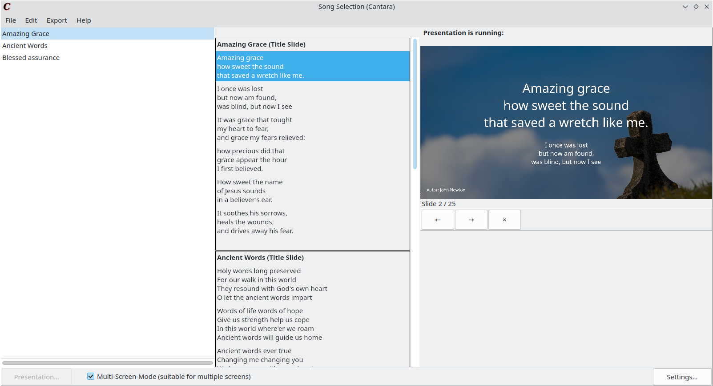

<div align="center"


<h1>Cantara</h1>

<span style="font-size:1.5em;">A program for quick, easy but beautiful hymn presenting in churches.</span>


</div>

Cantara is a simple open source song presentation software written in Free Pascal/Lazarus which allows people to spontanously present song lyrics for a bigger audience for the purpose of singing together. This is especially useful for church groups and meetings. 



More pictures are in the [screenshots/](screenshots/)-Folder.

> [!NOTE]
> This is just the repository for the source code. For general information, please visit the [Cantara webpage](https://cantara.app) with a complete documentation and instruction on downloading, installing and using the program.

**Pull Requests or issues** with bug reports, suggestions or general feedback are very appreciated!

If you like the project, please consider to *star* it on Github!

## Download
For normal producive using purposes, please check the [installation instructions on the Cantara webpage](https://www.cantara.app/tutorial/install-cantara/index.html). There are different installation options depending on your operating system.

Cantara is also available in the Microsoft Winget Repository, the Arch User Repository (AUR), at the snap store and on flatpak. The edge version contains the latest commit to the master branch.

[](https://aur.archlinux.org/packages/cantara/)
[](https://aur.archlinux.org/packages/cantara-bin/)

[](https://snapcraft.io/cantara)
<a href='https://flathub.org/apps/details/app.cantara.Cantara'></a>

```
winget install cantara
```
```
yay -S cantara
```
```
yay -S cantara-bin
```
```
snap install cantara
```
```
flatpak install cantara
```

Go to the [release section](https://github.com/reckel-jm/cantara/releases/) on Github to download the binaries for a productive use of the software.
The master branch of this repository contains the latest commits which were already tested and **should** work, but are not officially released yet. If you clone from master, you might expect bugs, misbehavior or other errors when running the application. If you find any of them, please feel free to report them as a Github issue!

## Compile and run Cantara manually

If you would like to compile the latest not stable state in the master branch, you need to do the following:

 1. Download and install the [Lazarus IDE](https://www.lazarus-ide.org) – either via your distribution or their homepage.
 2. Clone the Github repository with its submodules (they are needed for building):

    `git clone --recurse-submodules git@github.com:reckel-jm/cantara.git`

 3. Open the `lazarus.lpi` file *as a project* in Lazarus and compile it **or** use `lazbuild` for the compilation via the command line to compile the used packages first and then compile the Cantara project itself:

   `lazbuild -B src/bgrabitmap/bgrabitmap/bgrabitmappack.lpk && lazbuild -B src/metadarkstyle/metadarkstyle.lpk && lazbuild -B src/Cantara.lpi && lazbuild -B src/Cantara.lpi`

On Linux, you can change the used graphical framework via the `--ws=qt6` `--ws=qt5` or `--ws=gtk2` option. In addition, you can build the projekt via `make`.

> [!WARNING]
> The state of the master branch is not stable and not ready for productive use! If you want a stable version, please go to the [releases section](releases/).

## Song templates
Please consult the [documentation](https://www.cantara.app/tutorial/where-to-get-the-songs/) for learning which song formats are supported and where to get songs from.

At the moment an other [GitHub Repository with public domain Christian song lyrics is under construction](https://github.com/reckel-jm/cantara_songrepo), which can be directly imported to Cantara.

## Settings
The color, background and font of the presentation can be changed in the settings.

## Contribution

Cantara would not have been possible with the help of many contributers. Thank you all!
Find details about the contributions and contributors on the [Contributers Page](https://github.com/reckel-jm/cantara/graphs/contributors) of this Github repository.

## Licence
The program is licenced under GPL3. See [COPYING](https://github.com/reckel-jm/cantara/blob/master/COPYING) for details. You may use and change this software and its source code and share it as you wish, but you need to add a copyright hint and keep the licence.
The file `src/exporters/templates/pptx/pptxgen.bundle.js` ist copied from the [PptxGenJS](https://github.com/gitbrent/PptxGenJS/) project and originally published by Brent Ely under [MIT license](https://github.com/gitbrent/PptxGenJS/blob/master/LICENSE).
